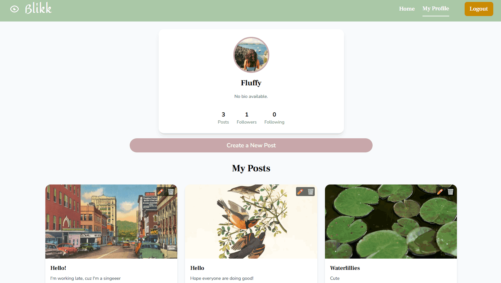

# Blikk (CSS Frameworks Course Assignment)



This project was created as a built on JavaScript course 2 project. It was originally code created by a teacher at Noroff, then edited with testing and more javascript by me in the Javascript 2 course. Lastly it was used in the CSS Frameworks course assignment where I was tasked to style the full website with Tailwind.

---

## Assignment Summary

Tasked with building a social blog post site with the following pages:

- **Homepage** – List of blog posts.
- **Profile Page** – View of the users profile where the user can manage their account.
- **Create/edit posts** – A form for users to both create and edit their posts.
- **Login/Register Page** – Login and register forms. Only student-email approved.

---

## Tech Stack

| Category           | Tools/Frameworks                |
| ------------------ | ------------------------------- |
| **Frontend**       | HTML, Javascript                |
| **Styling**        | Tailwind CSS                    |
| **Routing**        | Custom JS Routing               |
| **Notifications**  | Custom Tailwind toaster         |
| **Linting/Format** | ESLint, Prettier                |

---

## Deployment

The project is deployed using Netlify.
Live site:
[Blikk](https://css-frameworks-blikk.netlify.app/)

## Getting Started

### Clone the repository

```bash
git clone https://github.com/Maribsorensen/CSS-Frameworks-Public.git
```

### Install dependencies

```bash
npm install
```

### Start development server

```bash
npm run dev
```

### Build for production

```bash
npm run build
```

### Preview production build

```bash
npm run preview
```

# Contributing

As this project is for a course assignment, I am not accepting external contributions at this point. Feedback or suggestions are always welcome.

# Improvements 

This project has been improved by moving it to a new repository that is public so that it can be used in a portfolio. 
Additional improvements, based on teacher feedback and own wants:

- **Footer styling** - The footer has been styled to have bigger padding since it looked too squished in previous code
- **Post cards styling** - Cards have gotten a full style change. Set image size and fixed positions for better accessibility and symetrical structure
- **Deleted unused files** - All unused files from the previous project have been deleted
- **Delete comments** - The delete post comment have been fixed to be a smaller icon, as well as only visible for the owner of that comment
